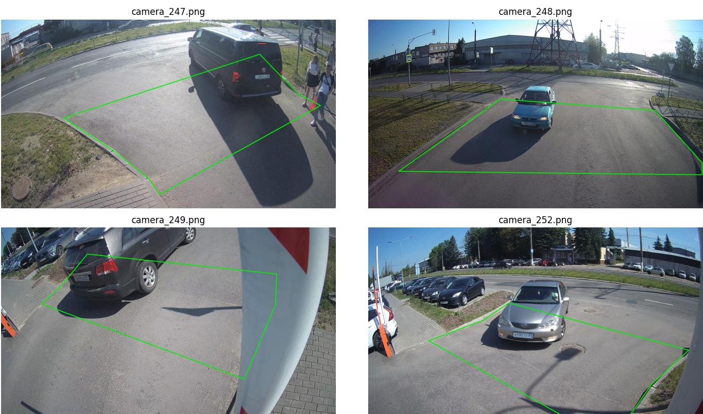

## Как пользоваться
### Если необходимо скачать видеофайлы из облака, выполнить извлечение кадров и удалить в последствии скаченные видеофайлы:
Необходимо в список `urls` внести ссылки на видеофайлы mp4.  
Настроить атрибуты экземпляра класса VideoProcessor:  
 - указать `is_show_bboxes=False`, если не надо отрисовывать bbox-ы на извлекаемых кадрах.  
 - указать шаг извлечения кадров из видео в `stride_frame`.  
 - указать `is_download_videos=True` для получения видеофайлов по ссылкам из облака.  
 - указать `is_processing=True` для активации извлечения кадров.  
 - указать `is_delete_video=True` для последующего удаления скачанных ранее видеофайлов.

Метод `process.run()` запускает процесс скачивания, обработки и извлечения кадров, удаления скачанного видео.  
```cmd
urls = ['https://cloud.com/videofile-1.mp4', 'https://cloud.com/videofile-2.mp4']

process = VideoProcessor(urls_list=urls,
                         polygons_dict=polygons,
                         confidence=0.5,
                         is_show_bboxes=False,
                         stride_frame=10,
                         is_download_videos=True,
                         is_processing=True,
                         is_delete_video=True)

process.run()
```

  
### Если необходимо использовать локальные видеофайлы и выполнить извлечение кадров:
Необходимо положить видеофайлы mp4 в папку проекта `Source_video`.
Настроить атрибуты экземпляра класса VideoProcessor:  
 - указать `is_show_bboxes=False`, если не надо отрисовывать bbox-ы на извлекаемых кадрах.  
 - указать шаг извлечения кадров из видео в `stride_frame`.  
 - указать `is_download_videos=False` для получения видеофайлов из локальной папки Source_video.  
 - указать `is_processing=True` для активации извлечения кадров.  
 - указать `is_delete_video=False` для запрета удаления видеофайлов из папки Source_video.  

Метод `process.run()` запускает процесс обработки и извлечения кадров из локальной папки Source_video.  
```cmd
process = VideoProcessor(urls_list=urls,
                         polygons_dict=polygons,
                         confidence=0.5,
                         is_show_bboxes=False,
                         stride_frame=10,
                         is_download_videos=False,
                         is_processing=True,
                         is_delete_video=False)

process.run()
```

## Алгоритм работы программы:
1. Пользователь указывает список ссылок в переменной `urls` по которым необходимо выполнить скачивание видеофайлов mp4 из облака или складывает свои видеофайлы в папку `Source_video`.  
2. Настраивает атрибуты экземпляра класса VideoProcessor в зависимости от необходимых задач.
3. Запускает код программы `main.py`.  
4. Скачивается первое видео в папку `Sourse_video` или используется первое видео из папки `Sourse_video` в зависимости от настройки.
5. Из названия файла определяется номер камеры.
6. В зависимости от номера камеры применяется нужная зона интереса для данного видео.  
7. Происходит извлечение необходимых кадров (на которых присутствует транспорт в зоне интереса, а также присутствует автомобильный номер в зоне интереса) в папку `Out_frames` в формате jpg.  
8. Скачанное ранее видео удаляется из папки `Sourse_video`.  
9. Происходит скачивание следующего видео из списка `urls` или использование следующего видео из папки `Sourse_video`. 
10. Цикл продолжается до последнего видео из списка `urls` или из папки `Sourse_video`.  


## Результат работы программы:


## Программа работает с камерами:  
 - 10.121.15.247  
 - 10.121.15.248  
 - 10.121.15.249  
 - 10.121.15.252

## Вид с камер:
  

## Вид с камер с зонами интереса (полигоны):
  

## Установка:
1. Клонируйте репозиторий себе на компьютер.
2. Откройте папку проекта в любой IDE. Убедитесь, что в терминале вы находитесь в папке проекта.
3. Создайте виртуальное окружение.  
```shell
python -m venv venv
```
4. Перейдите в виртуальное окружение и активируйте его.
```shell
venv\Scripts\activate
``` 
5. Установите все необходимые библиотеки. 
```shell
pip install -r requirements.txt
```
6. Запустите код на выполнение.
```shell
python main.py
```


